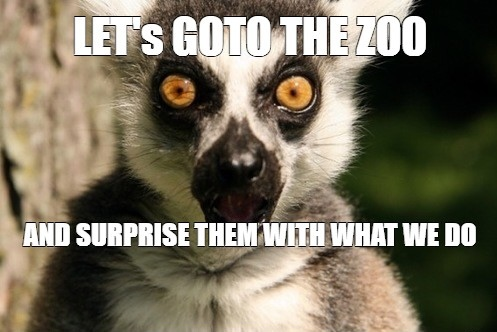

# Zootopia API



Zootopia API is a Python project that generates an HTML website with animal information.

The program asks the user for an animal name, fetches matching animal data from the API Ninjas Animals API, and creates an `animals.html` file with the results.

This project is part of a school exercise about working with APIs, JSON data, environment variables, dotenv, and generating HTML with Python.

## Features

- Fetches animal data from an external API
- Uses a `.env` file for the API key
- Generates an HTML page from a template
- Shows a clear message if no animal was found
- Uses a separate data fetcher module for API requests

## Installation

Clone the repository and install the required packages:

```bash
pip3 install -r requirements.txt
```

## Configuration

Create a `.env` file in the root folder of the project.

Add your API key like this:

```env
API_KEY='your_api_key_here'
```

The `.env` file should not be committed to GitHub because it contains sensitive information.

## Usage

Run the website generator:

```bash
python3 animals_web_generator.py
```

Enter an animal name when the program asks for it:

```text
Enter a name of an animal: Fox
```

After that, the program creates the file:

```text
animals.html
```

Open `animals.html` in a browser to see the generated animal website.

## Project Structure

```text
zootopia-api/
├── assets/
│   └── animal-pic.jpg
├── animals_web_generator.py
├── data_fetcher.py
├── animals_template.html
├── animals.html
├── requirements.txt
├── .gitignore
└── README.md
```

## Notes

The API request logic is stored in `data_fetcher.py`.

The website generation logic is stored in `animals_web_generator.py`.

This keeps the project structure cleaner because fetching data and generating HTML are two separate responsibilities.

## Contributing

This is a school project, but suggestions and improvements are welcome.